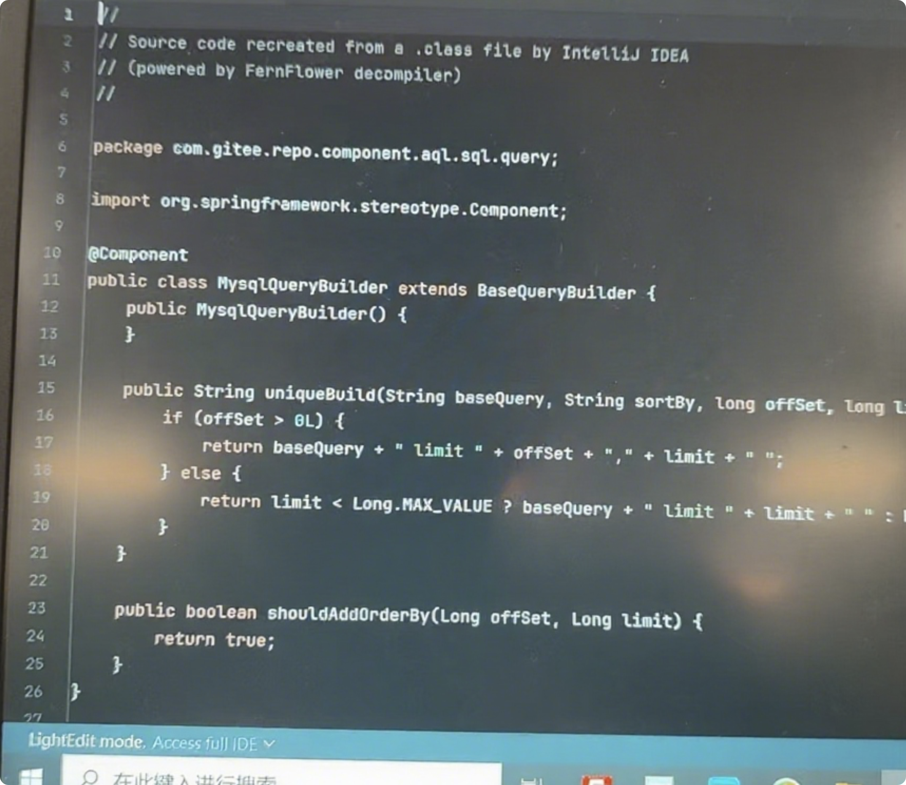
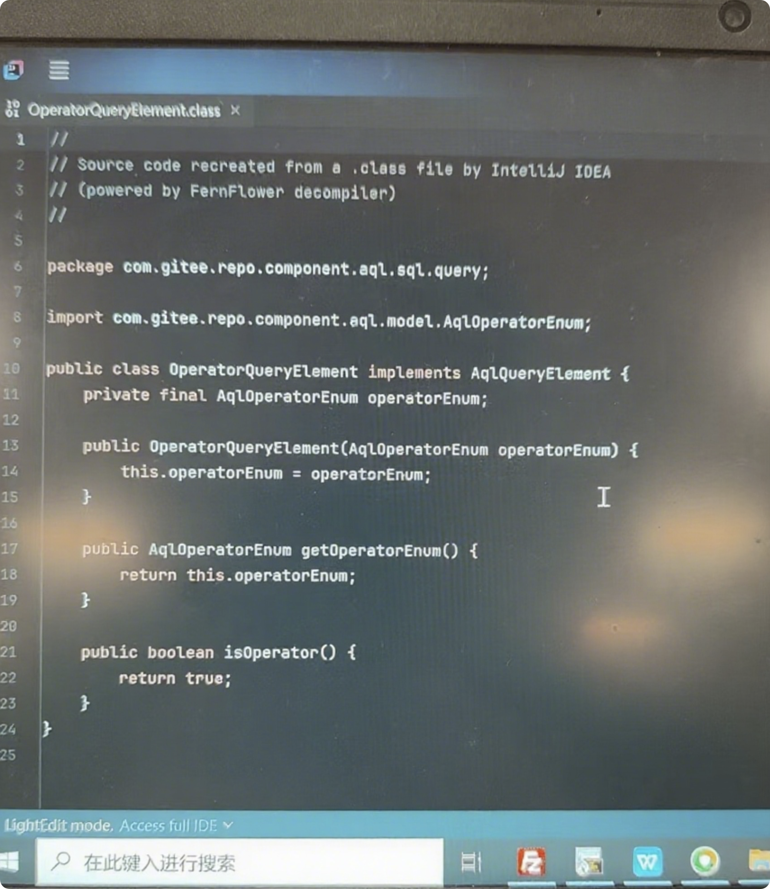

# In-depth Exposure: Gitee Repo Suspected of Large-scale Plagiarism of JFrog Artifactory – When Will Domestic Software Stop "Copycatting"?
[简体中文](./readme.md) | English

As a tech professional who has long focused on the DevOps ecosystem and firmly supports JFrog Artifactory, I have recently heard frequent rumors that "Gitee Repo is highly similar to JFrog Artifactory" – from internal revelations by former Gitee R&D staff to feedback from client-side users that "Gitee staff admitted the code is identical to ensure compatibility." Such information has raised strong doubts in me regarding the technical origin of Gitee Repo.

To verify the authenticity of these rumors, I conducted an in-depth comparison of the two products through **reverse engineering (decompilation)**. The final findings were shocking: Gitee Repo is not independently developed; instead, it is a direct derivative of JFrog Artifactory’s code, with only simple modifications (replacing package names while retaining core logic and class names), suspected of constituting large-scale plagiarism. Below, combined with newly supplemented evidence, I present a more comprehensive verification process and conclusions.


## I. Verification Preparation: Confirming Comparison Versions and Objectives
To ensure the objectivity of the comparison, I selected publicly available stable versions as samples:
- **JFrog Artifactory Version**: artifactory-7.84.12 (official public installation package, decompressed for code comparison)
- **Gitee Repo Version**: Obtained from an actual deployment environment (deployed via Docker containers, including frontend, backend services, routing, and Redis components; container image paths include `docker-hub.gitee.work/gitee-prod/gitee-repo-ng`, etc. As shown in Figure 13, the container list clearly includes images related to Gitee Repo).

Core verification objective: Decompile the core JAR packages of the two products, compare their code structures, class names, and core logic for high consistency, and determine whether plagiarism exists.


## II. Preliminary Findings: JAR Package Naming and Structure Reveal "Common Origin"
After accessing the Docker container of Gitee Repo (via the `docker exec` command) and copying out the core software packages, the first obvious anomaly emerged:

### 1. Core JAR Packages Directly Retain the "artifactory" Naming
In the `lib` directory of Gitee Repo, there are numerous JAR packages named with "artifactory", such as `artifactory-component-1.0-SNAPSHOT.jar` and `artifactory-core-1.0-SNAPSHOT.jar` (as shown in Figure 6, these JAR packages are clearly displayed in the file manager). This naming convention is completely consistent with that of official JFrog Artifactory JAR packages. Moreover, based on file modification times (mostly concentrated between January and April 2025), these are not outdated dependencies but core components of Gitee Repo.


### 2. Only a "SpringBoot Shell" Added to the Outer Framework; Core Dependencies Unchanged
Further analysis of the directory structure revealed that Gitee Repo only added a simple SpringBoot framework wrapper externally (the directory path includes `org.springframework.boot.loader`), while the core business logic fully relies on the aforementioned JAR packages named with "artifactory". As shown in Figure 7, the file list of the SpringBoot wrapper layer clearly indicates that it only contains classes related to startup and loading, with no actual business logic.


## III. In-depth Verification: Decompiling Core JAR Packages – "High Code Consistency" Confirmed
While file names and structures alone are insufficient to prove plagiarism, decompilation and comparison of core JAR packages directly expose the "copycat" nature of Gitee Repo. I selected `artifactory-db-1.0-SNAPSHOT.jar` (named by Gitee) and JFrog Artifactory’s `artifactory-db.jar` – which best reflect business logic – for comparison. The result showed that **the code of core classes is completely identical except for package name replacement**.  


### 1. "Futile Concealment" of Package Names: Only Replaced with Gitee Domain, Class Names Fully Retained
Gitee batch-replaced JFrog Artifactory’s package names from `org.artifactory.xxx` to `com.gitee.repo.xxx`, but the core class names, method names, and parameter lists remained unchanged. The following uses newly added code screenshots (Figures 1–4) to show specific class comparisons:  


- **Figure 1: Comparison of the AqlParser Class**  
  The `AqlParser` class in Gitee Repo (package name: `com.gitee.repo.component.aql.parser.elements.low`) and the corresponding class in JFrog Artifactory are identical in terms of static variables such as `DELIMITERS` and `USED_KEYS`, as well as the instantiation logic of various elements – except for the package name.


- **Figure 2: Comparison of the SortDetails Class**  
  The `SortDetails` class in Gitee Repo (package name: `com.gitee.repo.component.aql.model`) and the same class in JFrog Artifactory have identical code logic for member variables (`sortType`, `list`), constructors, and methods such as `addField` and `setSortType`.


- **Figure 3: Comparison of the MysqlQueryBuilder Class**  
  The `MysqlQueryBuilder` class in Gitee Repo (package name: `com.gitee.repo.component.aql.sql.query`) inherits from `BaseQueryBuilder`. The logic for concatenating SQL limit statements in its `uniqueBuild` method is completely the same as that of the corresponding method in JFrog Artifactory.



- **Figure 4: Comparison of the OperatorQueryElement Class**  
  The `OperatorQueryElement` class in Gitee Repo (package name: `com.gitee.repo.component.aql.sql.query`) implements the `AqlQueryElement` interface. The code for its constructor, `getOperatorEnum` method, and `isOperator` method is identical to that of the same class in JFrog Artifactory.



- **Figure 5: Comparison of the AqlAdapter Class**  
  The newly supplemented code screenshot of the `AqlAdapter` class (as shown in Figure 1) indicates that the constructor, `createSimplePropertyCriteria`, `createComplexPropertyCriteria`, and other core methods of this class in Gitee Repo are completely consistent with those of the corresponding class in JFrog Artifactory in terms of logic, parameters, and return values – only the package name has been replaced with one related to `com.gitee.repo`.  
  

### 2. "Copy-paste" Code Logic: Taking the AqlParser Class as an Example
To more intuitively demonstrate the plagiarism, the following is a comparison of core code snippets of the `AqlParser` class from the two products (both from decompilation results):

#### AqlParser Class in JFrog Artifactory (Partial Code)
```java
package org.artifactory.storage.db.aql.parser.elements.low;

import org.artifactory.storage.db.aql.parser.elements.low.InternalEmptyElement;
import com.google.common.collect.Sets;
import java.util.Set;
import org.apache.commons.lang.StringUtils;

public class AqlParser {
    public static final String[] DELIMITERS = new String[]{"<=", ">=", "!=", " ", "<", ">", "(", ")", "[", "]"};
    public static final String[] USED_KEYS = new String[]{"$mt", "$lt", "$eq", "and", "not", "or", "artifacts"};
    // The remaining code is highly consistent with that in Gitee Repo...
}
```

#### AqlParser Class in Gitee Repo (Partial Code)
```java
package com.gitee.repo.component.aql.parser.elements.low;

import com.gitee.repo.component.aql.parser.elements.low.InternalEmptyElement;
import com.google.common.collect.Sets;
import java.util.Set;
import org.apache.commons.lang.StringUtils;

public class AqlParser {
    public static final String[] DELIMITERS = new String[]{"<=", ">=", "!=", " ", "<", ">", "(", ")", "[", "]"};
    public static final String[] USED_KEYS = new String[]{"$mt", "$lt", "$eq", "and", "not", "or", "artifacts"};
    // The remaining code is highly consistent with that in JFrog Artifactory...
}
```

**Comparison Conclusion**: Except for the package name (changed from `org.artifactory` to `com.gitee.repo`), the inheritance relationships, member variables, and core logic of the classes are completely identical – even variable names (such as `DELIMITERS` and `USED_KEYS`) remain unmodified. This is by no means a "coincidence" but a typical case of code copying. There are many more such examples that will not be listed one by one...

### 3. "Highly Copied" Directory Structure: Only Minor Path Adjustments, Core Hierarchy Unchanged
In addition to the code, the internal directory structures of the JAR packages of the two products are also highly similar. Taking the `artifactory-db`-related packages as an example, as shown in Figure 8, Gitee only changed the top-level package name from `org.artifactory.storage.db` to `com.gitee.repo.component`, but the names and hierarchical relationships of lower-level directories such as `action`, `parser`, and `model` are completely copied from JFrog. This "high coincidence" in structure further confirms the common origin of the code.


## IV. Controversial Focus: The "Legal Boundary" and "Moral Bottom Line" of Reverse Engineering
In the tech community, reverse engineering itself is not a "monster" – decompiling to learn the design ideas and technical architecture of excellent products is an important way to drive technological progress. However, **using reverse engineering to directly modify package names of code and commercialize it is a typical case of "piracy"**, which not only crosses legal red lines but also violates industry ethics.

- **Legal Perspective**: According to the *Copyright Law of the People’s Republic of China*, computer software is a protected work. Copying, modifying, and using the core code of software without the permission of the copyright owner is suspected of infringing copyright. If such actions are used for commercial purposes to obtain profits, they may also constitute unfair competition.
- **Moral Perspective**: As a world-leading artifact repository tool, JFrog Artifactory’s code embodies the efforts of numerous engineers and years of technical accumulation. As a well-known domestic code hosting platform, Gitee should have assumed the responsibility of "promoting the innovation of domestic software" but instead adopted the "copycat approach." This not only shows disrespect for JFrog’s intellectual property rights but also undermines the "independent innovation" concept in the domestic DevOps ecosystem.


## V. Reflection: Domestic Software Substitution Should Not Mean "Substitution by Plagiarism"
The suspected plagiarism incident of Gitee Repo has exposed the "short-sightedness" of some domestic software enterprises – in order to quickly seize the market and reduce R&D costs, they choose to take the "shortcut" of copying, while ignoring the core value of technological innovation.

As a supporter of JFrog, I have always believed:
1. **Innovation is the core of domestic software substitution**: Replacing foreign products relies on functions more tailored to the needs of domestic users, more stable performance, and better services – not "copy-pasting."
2. **Intellectual property protection is the cornerstone of industry development**: Only by respecting the technical achievements of others can more enterprises be encouraged to invest in R&D, forming a virtuous cycle of "innovation – protection – further innovation."
3. **Users should be alert to "fake domestic innovation"**: When choosing core tools such as artifact repositories, users need to pay attention to the legitimacy and transparency of the technical origin of the tools, and avoid legal risks or technical hidden dangers caused by using "plagiarized products."

Furthermore, this incident has also made me question the technical origin of other Gitee products (such as code repositories) – is there a similar situation of "plagiarizing GitLab"? I will continue to pay attention to this issue and plan to conduct further research on related products.


## Conclusion
Technology can be imitated, but the spirit of innovation cannot be copied; package names can be modified, but the fact of plagiarism cannot be concealed. It is hoped that Gitee will face up to this suspected plagiarism incident and publicly respond to the doubts of users and the industry. At the same time, it is also called on domestic software enterprises to learn a lesson from this incident, adhere to legal and moral bottom lines, and truly promote the development of domestic software through "independent innovation" – this is the correct way to achieve domestic software substitution.