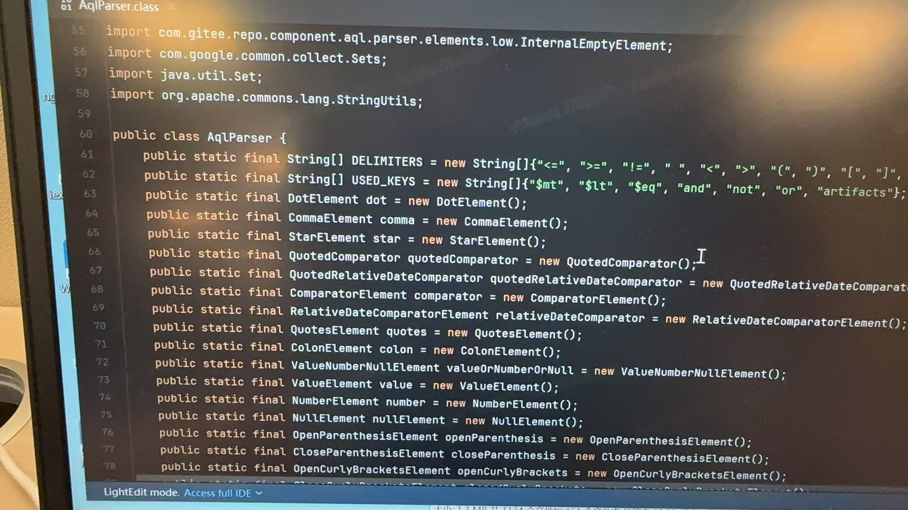
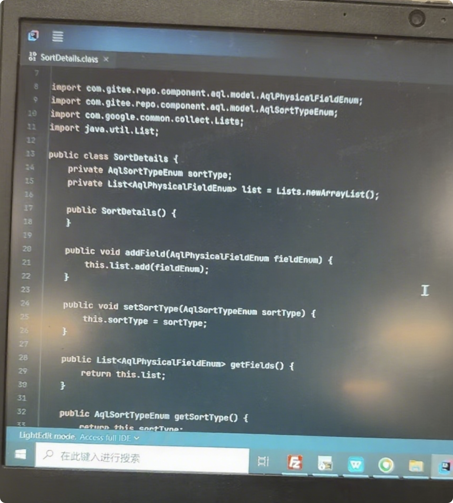
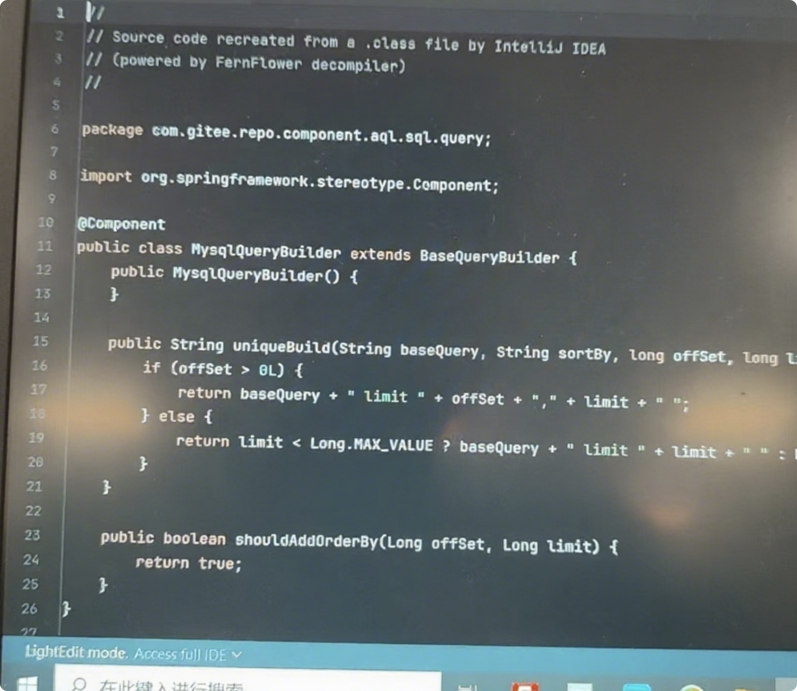
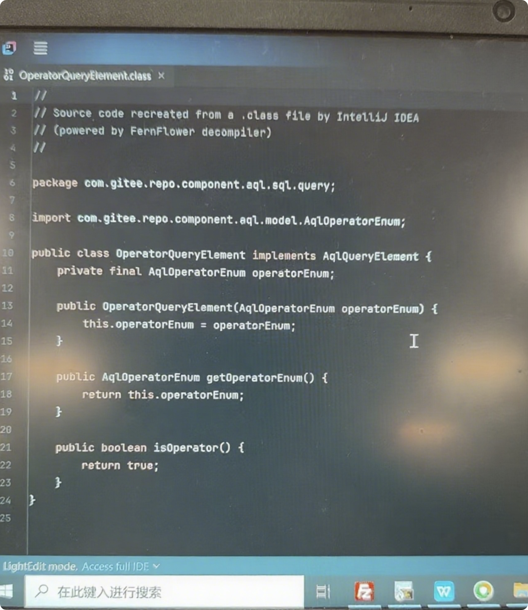

# 深度揭秘：Gitee制品库（Gitee Repo）疑似大规模抄袭JFrog Artifactory，“拿来主义”何时休？

[English](./readme-en.md) | 简体中文

作为一名长期关注DevOps生态、坚定支持JFrog Artifactory的技术从业者，近期频繁听闻“Gitee制品库与JFrog Artifactory高度相似”的传言——从Gitee离职研发的内部爆料，到甲方客户反馈“Gitee工作人员承认代码一致以保证兼容性”，这些信息让我对Gitee制品库的技术来源产生了强烈质疑。

为验证传言真实性，我通过**逆向工程（反编译）** 对两款产品进行了深度对比，最终发现的事实令人震惊：Gitee制品库并非自主研发，而是对JFrog Artifactory的代码进行简单修改（仅替换包名、保留核心逻辑与类名）后直接使用，疑似构成大规模抄袭。以下结合新补充的证据，呈现更完整的验证过程与结论。


## 一、验证准备：确定对比版本与目标
为保证对比的客观性，我选择了当前公开可获取的稳定版本作为样本：
- **JFrog Artifactory版本**：artifactory-7.84.12（官方公开安装包，解压后用于代码对比）
- **Gitee制品库版本**：通过实际部署环境获取（Docker容器部署，包含前端、后端服务、路由及Redis组件，容器镜像路径为`docker-hub.gitee.work/gitee-prod/gitee-repo-ng`等，如图13所示，容器列表中明确存在Gitee制品库相关镜像）

验证核心目标：通过反编译两款产品的核心JAR包，对比其代码结构、类名、核心逻辑是否存在高度一致性，判断是否存在抄袭行为。


## 二、初步发现：JAR包命名与结构暴露“同源性”
在进入Gitee制品库的Docker容器（通过`docker exec`命令进入）并拷贝出核心软件包后，第一个异常点就十分明显：

### 1. 核心JAR包直接沿用“artifactory”命名
Gitee制品库的`lib`目录下，存在大量以“artifactory”命名的JAR包，例如`artifactory-component-1.0-SNAPSHOT.jar`、`artifactory-core-1.0-SNAPSHOT.jar`（如图6所示，文件管理器中清晰展示了这些JAR包）。这些命名与JFrog Artifactory官方JAR包的命名规则完全一致，且从文件修改时间来看（多数集中在2025年1-4月），并非老旧依赖，而是Gitee制品库的核心组件。


### 2. 外层框架仅套“SpringBoot壳”，核心依赖未替换
进一步分析目录结构发现，Gitee制品库仅在外部用SpringBoot框架进行了简单封装（目录路径包含`org.springframework.boot.loader`），但核心业务逻辑完全依赖上述“artifactory”命名的JAR包。如图7所示，SpringBoot封装层的文件列表可清晰看到其仅为启动加载相关类，无实际业务逻辑。


## 三、深度验证：反编译核心JAR包，代码“高度一致”实锤
若仅靠文件名和结构还不足以证明抄袭，那么对核心JAR包的反编译对比，则直接暴露了Gitee制品库的“拿来主义”本质。我选择了最能体现业务逻辑的`artifactory-db-1.0-SNAPSHOT.jar`（Gitee侧命名）与JFrog Artifactory的`artifactory-db.jar`进行对比，发现**核心类的代码除包名替换外，完全一致**。

### 1. 包名“掩耳盗铃”：仅替换为Gitee域名，类名完全保留
Gitee将JFrog Artifactory的包名从`org.artifactory.xxx`批量替换为`com.gitee.repo.xxx`，但核心类名、方法名、参数列表均未修改。以下结合新的代码截图（图1 - 图4），展示具体类的对比：

- **图1：AqlParser类对比**
  Gitee制品库的`AqlParser`类（包名`com.gitee.repo.component.aql.parser.elements.low`）与JFrog Artifactory的对应类，除包名外，类中定义的`DELIMITERS`、`USED_KEYS`等静态变量及各类元素的实例化逻辑完全一致。



- **图2：SortDetails类对比**
  Gitee的`SortDetails`类（包名`com.gitee.repo.component.aql.model`）与JFrog的同类，在成员变量（`sortType`、`list`）、构造方法及`addField`、`setSortType`等方法的实现上，代码逻辑毫无差异。



- **图3：MysqlQueryBuilder类对比**
  Gitee的`MysqlQueryBuilder`类（包名`com.gitee.repo.component.aql.sql.query`）继承自`BaseQueryBuilder`，其`uniqueBuild`方法中拼接SQL limit语句的逻辑，与JFrog Artifactory的对应方法完全相同。



- **图4：OperatorQueryElement类对比**
  Gitee的`OperatorQueryElement`类（包名`com.gitee.repo.component.aql.sql.query`）实现`AqlQueryElement`接口，构造方法、`getOperatorEnum`和`isOperator`方法的代码，与JFrog的同类如出一辙。



- **图5：AqlAdapter类对比**
新补充的 `AqlAdapter`类代码截图（如图 1）显示，Gitee 制品库中该类的构造方法、createSimplePropertyCriteria、createComplexPropertyCriteria等核心方法，与 JFrog Artifactory 对应类的逻辑、参数、返回值完全一致，仅包名替换为com.gitee.repo相关。


### 2. 代码逻辑“复制粘贴”：以AqlParser类为例
为更直观展示抄袭行为，以下是两款产品中`AqlParser类`的核心代码对比（均来自反编译结果）：

#### JFrog Artifactory的AqlParser类（部分代码）
```java
package org.artifactory.storage.db.aql.parser.elements.low;

import org.artifactory.storage.db.aql.parser.elements.low.InternalEmptyElement;
import com.google.common.collect.Sets;
import java.util.Set;
import org.apache.commons.lang.StringUtils;

public class AqlParser {
    public static final String[] DELIMITERS = new String[]{"<=", ">=", "!=", " ", "<", ">", "(", ")", "[", "]"};
    public static final String[] USED_KEYS = new String[]{"$mt", "$lt", "$eq", "and", "not", "or", "artifacts"};
    // 其余代码与Gitee侧高度一致...
}
```

#### Gitee制品库的AqlParser类（部分代码）
```java
package com.gitee.repo.component.aql.parser.elements.low;

import com.gitee.repo.component.aql.parser.elements.low.InternalEmptyElement;
import com.google.common.collect.Sets;
import java.util.Set;
import org.apache.commons.lang.StringUtils;

public class AqlParser {
    public static final String[] DELIMITERS = new String[]{"<=", ">=", "!=", " ", "<", ">", "(", ")", "[", "]"};
    public static final String[] USED_KEYS = new String[]{"$mt", "$lt", "$eq", "and", "not", "or", "artifacts"};
    // 其余代码与JFrog侧高度一致...
}
```

**对比结论**：除包名从`org.artifactory`替换为`com.gitee.repo`外，类的继承关系、成员变量、核心逻辑完全一致，甚至连变量名（如`DELIMITERS`、`USED_KEYS`）都未做任何修改——这绝非“巧合”，而是典型的代码复制行为。
里面还有很多很多，不一一列举...

### 3. 目录结构“高度复刻”：仅微调路径，核心层级不变
除代码外，两款产品的JAR包内部目录结构也高度相似。以`artifactory-db`相关包为例，如图8所示，Gitee仅将顶层包名从`org.artifactory.storage.db`改为`com.gitee.repo.component`，但下层的`action`、`parser`、`model`等目录名称、层级关系完全复刻JFrog——这种结构上的“高度重合”，进一步印证了代码来源的同源性。


## 四、争议焦点：逆向工程的“合法边界”与“道德底线”
在技术圈，逆向工程本身并非洪水猛兽——通过反编译学习优秀产品的设计思路、技术架构，是技术进步的重要途径，但**逆向工程后将代码直接修改包名并商用，属于典型的“盗用行为”**，既触碰法律红线，也违背行业道德。

- **法律层面**：根据《中华人民共和国著作权法》，计算机软件属于受保护的作品，未经著作权人许可，复制、修改并使用其软件核心代码，涉嫌侵犯著作权；若用于商业用途并获利，还可能构成不正当竞争。
- **道德层面**：JFrog Artifactory作为全球领先的制品库工具，其代码凝结了无数工程师的心血与多年的技术积累；而Gitee作为国内知名的代码托管平台，本应承担“推动国产软件创新”的责任，却采用“拿来主义”，不仅是对JFrog知识产权的不尊重，更是对国内DevOps生态“自主创新”理念的践踏。


## 五、反思：国产软件替代，不应是“抄袭替代”
此次Gitee制品库疑似抄袭事件，暴露了部分国产软件企业的“短视”——为快速抢占市场、降低研发成本，选择走“抄近路”的捷径，却忽视了技术创新的核心价值。

作为一名JFrog支持者，我始终认为：
1. **国产软件替代的核心是“创新”**：替代国外产品，靠的是更贴合国内用户需求的功能、更稳定的性能、更优质的服务，而非“复制粘贴”；
2. **知识产权保护是行业发展的基石**：只有尊重他人的技术成果，才能激励更多企业投入研发，形成“创新-保护-再创新”的良性循环；
3. **用户应警惕“伪国产创新”**：选择制品库等核心工具时，需关注其技术来源的合法性与透明度，避免因使用“抄袭产品”而面临法律风险或技术隐患。

此外，此次事件也让我对Gitee其他产品（如代码库）的技术来源产生质疑——是否存在类似“抄袭GitLab”的行为？后续我将持续关注，并计划对相关产品进行进一步调研。


## 结语
技术可以模仿，但创新精神无法复制；包名可以修改，但抄袭的事实无法掩盖。希望Gitee能正视此次疑似抄袭事件，公开回应用户与行业的质疑，同时也呼吁国内用户不要使用Gitee相关产品，以免带来法律风险。
